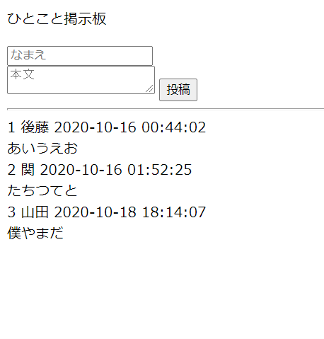

# ひとこと掲示板

Python3を用いて、ひとこと掲示板を作成しました。

# デモ



「名前」と「本文」を入力し、投稿することできます。

# 環境

Ubuntu 20.04.1 LTS

Python 3.8

MySQL Ver 8.0.21

# 事前準備

pip3コマンドをインストールします。

```bash
$ curl https://bootstrap.pypa.io/get-pip.py -o get-pip.py
$ sudo python3 get-pip.py
```

pip3コマンドでmysqlclientをインストールします。

```bash
$ pip3 install mysqlclient
```

userdir.confのOptionsにExecCGIを追加します。

```bash
Options ExecCGI MultiViews Indexes
```

CGIモジュールを有効にします。

```bash
$ sudo a2enmod cgi
$ sudo systemctl restart apache2
```

~/public_html/.htaccessを以下の内容で作成します。

```bash
AddHandler cgi-script .cgi
```

~/public_html/.envを以下の内容で作成します。

```bash
bbs_db_host = ホスト名
bbs_db_user = ユーザ名
bbs_db_pass = パスワード
bbs_db_name = DB名
```

プロジェクトのトップページからクローン用のURLをコピーし、以下のコマンドを入力します。

```bash
$ git clone コピーしたURL
```

# 使用方法

ブラウザで以下のアドレスを入力します。

```bash
http://[IPアドレス]/~[ユーザ名]/bbs.py
```

# 注意

Macではテストを行っていません

# 作成者

後藤
