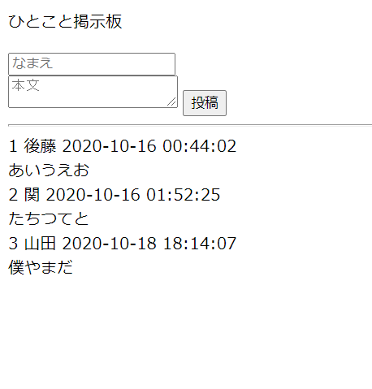

# ひとこと掲示板

研修でPython3を用いて、ひとこと掲示板を作成しました。

# デモ



「名前」と「本文」を入力し、投稿することできます。

# 環境

Ubuntu 20.04.1 LTS

Python 3.8

MySQL Workbench 8.0 CE

# インストール

pip3コマンドでmysqlclientをインストールします。

```bash
pip3 install mysqlclient
```

# 使用方法

ブラウザで以下のアドレスを入力してみてください。

```bash
http://[自分のIPアドレス]/~[ユーザ名]/bbs.py
```

# 注意

Macではテストを行っていません

# 作成者

後藤
